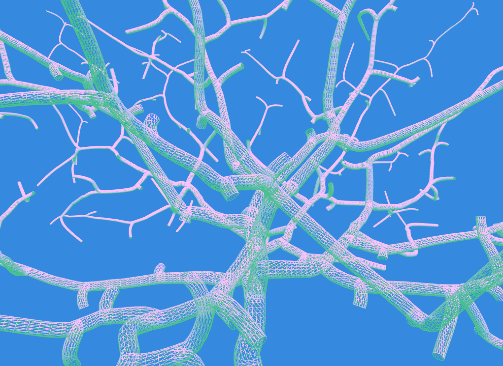
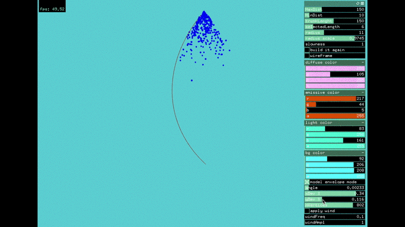

# ofxSpaceColonization

[](https://ci.appveyor.com/project/edap/ofxspacecolonization)


This addon is an openFrameworks implementation of the paper [Modeling Trees with a Space Colonization Algorithm](http://algorithmicbotany.org/papers/colonization.egwnp2007.large.pdf) by Adam Runions, Brendan Lane, and Przemyslaw Prusinkiewicz.


### Dependecies
It requires [ofxBranchesPrimitive](https://github.com/edap/ofxBranchesPrimitive). The example *example-ofxenvelope* requires the addon [ofxEnvelope](https://github.com/edap/ofxEnvelope)

### Usage

```cpp
//in your header file
ofxSpaceColonization tree;

// in your App.cpp file
void ofApp::setup(){
    tree.build();
}

void ofApp::update(){
    tree.grow();
}

void ofApp::draw(){
    tree.draw();
}
```

This will generate a tree using this standard options:

```cpp
static const ofxSpaceColonizationOptions defaultSpaceColOptions = {
    150,                             // max_dist, leaves are attractive if closer than this distance
    10,                              // min_dist, leaves are attractive if farther than this distance
    150,                             // trunk_length, the length of the trunk
    glm::vec4(0.0f,0.0f,0.0f, 1.0f), // rootPosition, the position of the root
    glm::vec3(0.0f, 1.0f, 0.0f),     // rootDirection, the direction on which the tree will starts to grow
    7,                               // branchLength, the length of each branch
    false,                           // done growing, a value that indicates when the grow process is done
    false,                           // cap, if adding caps to the branches or not
    2.0,                             // radius, the radius of the branch
    16,                              // resolution, the resolution of the cylinders composing the geometry
    1,                               // textureRepeat, how many time a texture has to be repeated on a branch
    0.9997                           // radiusScale, how much the radius will increase or decrease at each interaction
};
```

You can specify yours options and pass it to the tree using the `setup` method:

```cpp
void ofApp::setup(){
    auto myOpt = ofxSpaceColonizationOptions({
       // ...
    });
    tree.setup(myOpt);
    tree.build();
}
```

The form of the tree changes depending on these options and on the position of the leaves. By default, some default leaves are provided but you can provide your leaves by using the `setLeavesPositions()` method. It takes a `vector<glm::vec3>` as argument.

```cpp
void ofApp::setup(){
    vector<glm::vec3> points;
    // ... fullfill the vector
    tree.setLeavesPositions(points);
    tree.build();
}
```

I've created an addon that can be used to generate the points, it is called [ofxEnvelope](https://github.com/edap/ofxEnvelope) and you can see in the example `example-ofxenvelope` how to use it.


### Wind

The `grow` method takes a `glm::vec3` as optional parameter. This vector can be used to move the leaves, like [this](https://www.instagram.com/p/BV8B0FGDi1L/?taken-by=edapx)
Example:

```cpp
void ofApp::update(){
  float t = ofGetElapsedTimef();
  float n = ofSignedNoise(t * windFreq) * windAmpl;
  auto wind = glm::vec3(n,0.0,0.0); // a weird wind that only breezes on the x axis
  tree.grow(wind);
}
```


### Examples

*example-3d*


*example-ofxenvelope*


### License
MIT

### Notes
Notes:
This sources were helpful to understand how other people implement the algorithm. Thanks to their authors for making them public.

[Procedurally Generated Trees with Space Colonization Algorithm in XNA C#](http://www.jgallant.com/procedurally-generating-trees-with-space-colonization-algorithm-in-xna/)

[Daniel Shiffman Video](https://www.youtube.com/watch?v=kKT0v3qhIQY)

[space-colonization](https://github.com/nicknikolov/space-colonization)
